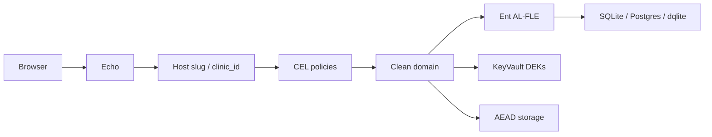
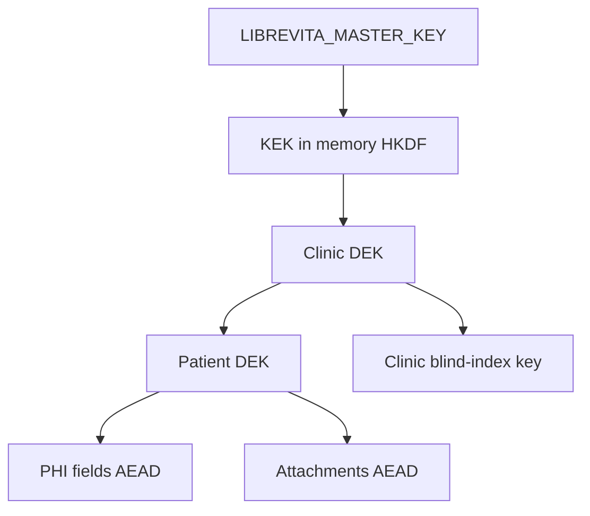

# LibreVita

[](https://github.com/librevita/librevita/actions/workflows/ci.yaml)
[](https://go.dev/dl/)
[](LICENSE)
[]()

> _"In quella parte del libro de la mia memoria dinanzi a la quale poco si potrebbe leggere, si trova una rubrica la quale dice: **Incipit vita nova**."_  
> — **Dante Alighieri**, _Vita Nuova_ (c. 1294)

**LibreVita** is a sovereign electronic health record (EHR) and clinic management platform built in Go with **Application-Layer Field-Level Encryption (AL-FLE)**, **Blind Indexing**, and **Tokenized Name Search**. Uniting the principled tradition of **Libre Software** with Dante’s **_Vita Nuova_** (_"New Life"_), LibreVita marks a new beginning for clinical privacy, human dignity, and patient data sovereignty. The module path is `librevita.org`.

Licensed **[AGPL-3.0-or-later](LICENSE)**. The [FOSS social contract](#license-and-foss-social-contract) pledges that encryption, policies, and audit stay in the commons — no open-core, no relicensing.

## Contents

- [Why LibreVita](#why-librevita)
- [Architecture](#architecture)
- [Capabilities](#capabilities)
- [Security model](#security-model)
- [Quick start](#quick-start)
- [Build and develop](#build-and-develop)
- [Frontend and supported browsers](#frontend-and-supported-browsers)
- [Container image](#container-image)
- [Production: keys, TLS, DNS, and proxy](#production-keys-tls-dns-and-proxy)
- [Configuration](#configuration)
- [File storage](#file-storage)
- [Database and migrations](#database-and-migrations)
- [HTTP surface](#http-surface)
- [Onboarding](#onboarding)
- [Authentication and authorization](#authentication-and-authorization)
- [Internals](#internals)
- [License and FOSS social contract](#license-and-foss-social-contract)
- [Further reading](#further-reading)

## Why LibreVita

Most clinical software treats privacy as a deployment checkbox: TLS in transit, volume encryption at rest, row-level `clinic_id` filters, and a vendor promise that staff will not look. LibreVita is built for a harder claim. The **host is not trusted with plaintext PHI**. A stolen database file, a curious DBA, a leaked backup, or a compromised replica should see authenticated ciphertext — and search, multi-clinic isolation, and the right to erasure still have to work.

**Host-proof fields.** Sensitive columns are encrypted in the application with XChaCha20-Poly1305 before they reach Ent or SQL. The database stores `BLOB`/`BYTEA` plus derived indexes, never the name, phone, document, or SOAP narrative in the clear. Disk encryption remains good hygiene; it is not the confidentiality boundary.

**Search that does not leak the corpus.** Exact lookup (phone, email, identification document) uses a **keyed blind index**: a domain-separated digest of the normalized value, scoped by `clinic_id`. Reception can still type a prefix of a name and find `Carlos` because **tokenized name search** stores hashed prefix n-grams, not plaintext. The ciphertext stays opaque; the index is a capability, not a second copy of the record.

**Envelope keys and real erasure.** A process-memory **KEK** (HKDF from `master_key`) wraps a **Clinic DEK**, which wraps a **Patient DEK**. Patient fields and attachments are sealed under that patient key, authenticated with the patient URN. Deleting the Patient DEK (**crypto-shredding**) turns remaining ciphertext into unrecoverable noise — the GDPR/LGPD right to be forgotten as a cryptographic operation, not only a `DELETE`. An operator who holds **both** the master key and the vault can still unwrap a clinic; that is stated in the [threat model](#product-threat-model), not hidden.

**Clinic isolation that is cryptographic, not only a `WHERE` clause.** Many clinics share one schema and one process. The isolation boundary is the clinic, resolved from Host `{slug}.{base_domain}`, named only `clinic_id` (no `tenant_id` alias). Each clinic has its own DEK hierarchy, host-only cookies, and copied roles/policies. See [ADR 0002](docs/adr/0002-multi-clinic-shared-schema.md).

**SOAP is the chart; FHIR is a wire.** Clinicians reason about an `Episode` (narrative SOAP plus findings, problems, and plan items), encrypted with the Patient DEK. FHIR R4 is a **replaceable interop module** that maps that aggregate to a document Bundle. LibreVita is not a general-purpose FHIR server and does not persist FHIR JSON as the source of truth — a future R5 is another adapter, not a rewrite of the chart. See [ADR 0003](docs/adr/0003-hybrid-fhir-soap.md).

**Authorization you can read and change.** Permissions are **CEL** expressions stored in the database, compiled, versioned, and edited at `/policies`. A broken expression is rejected; renaming a role that policies mention by name is rejected; `admin.view` cannot lock the last administrator out of the editor. The rules are bounded (no loops, no side effects) and auditable.

**Tamper-evident history, honestly scoped.** Clinical and security events append to a hash-chained `audit_log`. Triggers make the table append-only; `GET /audit/integrity` reports the first break. That is **tamper-evidence**, not a transparency log: someone with raw database write access can recompute the chain. Detection requires actually verifying.

**The reception desk is a first-class computer.** The runtime is a **static Go binary** (`CGO_ENABLED=0`), optional `scratch` image, pure-Go SQLite, cross-builds to architectures such as `riscv64` and `loong64`. The UI floor is a PowerPC iBook G4 and Firefox 45-era browsers. Cheap SBCs and twenty-year-old PCs are product targets, not nostalgia.

## Architecture

A request is classified by Host, authorized with CEL, then handled in a Clean Architecture domain. PHI never crosses into SQL or object storage in plaintext.



`cmd/web` is the Fx composition root: config, telemetry, vault, crypto, database (Goose migrations before listen), storage, audit, auth, clinic, policy, HTTP, UI, domains, and the FHIR adapter. Apex hosts (`base_domain` / `www.`) serve platform operators. Clinic hosts (`{slug}.{base_domain}`) attach `clinic_id`, load the Clinic DEK, and scope FLE. Session and CSRF cookies are host-only.

Each domain (`clinic`, `user`, `patient`, `identifier`, `calendar`, `episode`) uses the same layers:

- **`model/`** — structs, value types, domain errors, repository interfaces. No `usecase/`, `repository/`, or `ent/`.
- **`repository/`** — Ent adapters implementing `model/` ports.
- **`usecase/`** — application services on `model/` types.
- **`delivery/http/`** — Echo handlers. Episode HTML is nested under the patient record; FHIR R4 lives in `internal/interop/fhir`, not in the episode package.
- **`module.go`** — Fx wiring.

The UI is the GOTH stack (Go, templ, HTMX) with Alpine’s CSP build for ephemeral widgets: server-driven HTML, assets embedded in the binary, no CDN or Node at runtime. Clinical state stays on the server.

## Capabilities

Clinical and administrative features live under `internal/domain`.

- **Patients** — registry CRUD with tokenized prefix search (debounced, server-side, over hashed n-grams in `display_name_token_index`), active/archived status, bulk archive, audit-backed change history, attachments encrypted with the Patient DEK and checksummed before storage, audited downloads, and identification documents (system + value) under envelope encryption with a keyed blind index for exact lookup. Duplicates are rejected deployment-wide. Document systems (pattern, transform, check digit) are administered at runtime so a deployment registers its jurisdictions without a code change. `patient.edit` is resource-level: physicians edit patients they registered; admins edit everything. `POST /patients/:id/shred` erases the aggregate and shreds the Patient DEK.
- **Identifiers** — catalog of jurisdictional document systems (CPF, RG, NHS Number, SSN, and others) with regex patterns, canonical transforms, and check digits (Luhn, Mod11). Clinics opt in; patient values are encrypted and blind-indexed.
- **Clinic** — profile (name, tax id, contact, timezone), provisioned on the apex, resolved per request from Host. Shared schema, isolated by `clinic_id` and the FLE key hierarchy ([ADR 0002](docs/adr/0002-multi-clinic-shared-schema.md)).
- **Staff and specialties** — specialty catalog and physician directory. Receptionists propose profile changes; an administrator approves or rejects. Requests snapshot the previous profile so the diff stays readable; the flow is audited.
- **Episodes (SOAP chart)** — `Episode` plus SOAP narrative and `Finding` / `Problem` / `PlanItem`, encrypted with the Patient DEK. HTML under `/patients/:id/episodes`. Finding and problem codes use `fle.SearchableDocument` for exact match. A `finalized` note is immutable; an amendment is a new episode on a linear `replaces` chain (`predecessor_id` unique). Policies: `chart.view`, `chart.write`. Wire format: [FHIR R4](#fhir-r4).
- **Calendar** — timezone-aware month and week grid (`calendar.view`). Appointments on the page are **fixtures**: nothing is persisted yet. Repository, use case, and SSE live updates arrive with the appointments feature.
- **Users** — staff accounts, relational roles (system roles plus custom; clinical flag joins the physician directory). Anti-lockout refuses to demote or deactivate the last active admin in one atomic statement. Registration is never public after onboarding (`users.register`).
- **Preferences** — per-user UI theme (`system` / `light` / `dark`) and personal timezone (empty inherits the clinic). The shell renders the theme on the server; the clock falls back to the clinic zone.

## Security model

### Cryptographic core, AL-FLE, and envelope encryption

LibreVita implements **Application-Layer Field-Level Encryption (AL-FLE) with Blind Indexing** in `internal/core/crypto` and `internal/core/database/fle`: host-proof persistence, column-level AEAD, exact-match blind indexes, tokenized name search, and per-patient envelope encryption with DEKs stored outside the clinical database.

- **Keyed hasher (`crypto.Hasher`) and digest primitives (`internal/core/crypto/digest.go`)** — keyed and unkeyed hashing for blind indexes, audit, stream verification, and session token ids, with cryptographic agility:
  - Prefixed output: `<algorithm>$<hex_hash>` (e.g. `blake2s$3f4a...`).
  - Engines: `blake2s` (default, friendly to 32-bit hardware) and `blake2b` (`crypto.hash_algorithm`).
  - `crypto.NewDigest`, `crypto.NewDigestWithKey`, `crypto.Digest256`, `crypto.DigestReader`, `crypto.RandomBytes`, `crypto.RandomHex`, `crypto.ConstantTimeCompare`.
  - Blind index: `system || '\x00' || value` so `patient.phone` and `patient.email` do not collide across domains.
- **Symmetric AEAD (`crypto.Encryptor`, `internal/core/crypto/cipher.go`)**:
  - Envelope: magic byte `0x01` (`MagicByteXChaCha20Poly1305`) then `[ Version (1B) | Nonce (24B) | Ciphertext + Poly1305 Tag ]`.
  - `crypto.NewAEADCipher(key)`, `crypto.NewAEADCipherByVersion(version, key)`, `crypto.SizeNonce` (24), `crypto.SizeAuthTag` (16).
  - Version byte leaves room for other ciphers (e.g. AES-256-GCM or post-quantum) without a schema migration.
  - Transient plaintext and keys are zeroized with `ZeroBytes`.
- **AL-FLE Ent extension (`internal/core/database/fle`)** — compile-time, zero-reflection, canonical `entc.Extension`:
  - Annotations: `fle.SearchablePhone()`, `fle.SearchableEmail()`, `fle.SearchableDocument()`, `fle.SearchableName()`, or `fle.Searchable()`, stored via `fle.EncryptedString()`.
  - `fle.Template` generates typed hooks (`encryptPatientMutation`) and decrypt interceptors. No `reflect` or `interface{}` at runtime. Encryptors, hashers, and Patient DEK resolvers come from `context.Context`.
  - Patient PHI AAD: `urn:librevita:clinic:<clinic_id>:patient:<patient_id>`. Clinic-owned ciphertexts use the clinic URN. No `tenant_id`.
  - `TransformSchemas` injects `<field>_blind_index TEXT` and `(clinic_id, <field>_blind_index)` for scalar searchable fields.
  - **Tokenized names:** `<field>_token_index JSON`, hashed prefix n-grams from `normalize.NameTokens` (e.g. `"Car"` → `"Carlos"`). Query via `json_each()` (SQLite) or `@>` on `JSONB` (PostgreSQL), always pre-filtered by `clinic_id`.
- **Normalization (`internal/core/normalize`)** — zero-allocation canonicalization before hashing (`normalize.Phone`, `normalize.Email`, `normalize.Text`) so `+55 11 98888-7777` and `5511988887777` share an index. `normalize.NameTokens` builds prefix n-grams (min 3) and drops Portuguese stop words with a compile-time `switch` (`isStopWord`).

**Envelope hierarchy (`*crypto.Engine`).** Physical separation across three key tiers; wrapped DEKs are stored in the KeyVault, not in the clinical database.



- **KEK** — HKDF from `master_key`, info `librevita:kek:v1`. Memory only; never written to disk.
- **Clinic DEK** — 32 bytes per clinic (`urn:librevita:clinic:<id>`), wrapped by the KEK. Wraps Patient DEKs and derives the clinic blind-index key; it does not encrypt patient PHI directly.
- **Patient DEK** — 32 random bytes per patient (`urn:librevita:clinic:<id>:patient:<id>`), wrapped by the Clinic DEK. PHI and attachments use XChaCha20-Poly1305; AAD is the patient URN.
- **Request cache (`crypto.WithRequestKeyCache`)** — unwraps once per request; keys are zeroized when the request ends.
- **KeyVault (`internal/core/vault`)** — DEKs live **outside** the primary database. `vault.backend`:
  - **`bbolt`** — embedded KV (default `<data-dir>/keys.db`).
  - **`nats`** — NATS JetStream KeyValue (`--vault-nats-url`, `--vault-nats-bucket`).
  - **`etcd`** — etcd v3 (`--vault-etcd-endpoints`, `--vault-etcd-prefix`).
  - **`hashicorp`**, **`hashicorp_vault`**, or **`openbao`** — Vault/OpenBao KV v2 (`--vault-hashicorp-address`, `--vault-hashicorp-token`, `--vault-hashicorp-mount`). Hard-delete metadata purges support physical shredding.
  - All backends implement `ConditionalKeyVault` (`PutIfAbsent`) and `BatchKeyVault` (`GetDEKs`).
- **Crypto-shredding** — deleting a Patient DEK makes that patient's ciphertext unrecoverable. `POST /patients/:id/shred` also removes relational rows, blind indexes, encrypted attachments, and records a tombstone (`ErrKeyDestroyed`) so the key cannot be resurrected. `DeleteClinicDEK` shreds a clinic by invalidating child Patient DEKs wrapped by it.

### Transport, sessions, and abuse controls

The application is same-origin; CORS is not configured. Responses use a strict **CSP** (`script-src 'self'`, no `unsafe-eval` / `unsafe-inline` except a hashed theme bootstrap), `X-Content-Type-Options: nosniff`, `Referrer-Policy: no-referrer`, `X-Frame-Options: DENY`, `Cross-Origin-Resource-Policy: same-origin`, `Permissions-Policy` (camera, microphone, geolocation denied), and `Cache-Control: no-store` on non-static responses. `Strict-Transport-Security` is opt-in via `--hsts-max-age` for HTTPS.

Passwords are Argon2id. Sessions are **PASETO v4.local** (payload encrypted with XChaCha20-Poly1305). The `sessions` table stores only a SHA-256 token id for revocation. CSRF is double-submit (`_csrf` / `X-CSRF-Token`). Login is rate-limited (10/min/IP); setup is rate-limited (5/min/IP). Concurrent Argon2id work is bounded (`--auth-max-concurrent-hashes`, default 4). Login always runs a hash verification so timing does not reveal whether an email exists. Details: [Authentication and authorization](#authentication-and-authorization).

### Product threat model

LibreVita assumes the **application process** may see plaintext for the duration of an authorized request, then zeroizes keys and buffers. It does **not** assume that the database, object store, or a replica is confidential on its own.

| Who / what | What they can do |
| --- | --- |
| Database, SQL replica, or stolen `.db` / dump without vault and master key | Read ciphertext, blind indexes, and metadata. Cannot decrypt PHI. Blind indexes allow equality (and token) queries, not recovery of names or documents. |
| Object storage without Patient DEK | Read encrypted blobs. Cannot authenticate or decrypt attachments. |
| Operator with `master_key` **and** the KeyVault | Unwrap Clinic DEKs and thus Patient DEKs. This is the installation owner. Protect the master key and vault like a root of trust. |
| Operator with the database **or** the vault, but not both | Incomplete: wrapped DEKs without KEK, or KEK without wrapped DEKs. |
| Clinic staff via the UI | Whatever CEL allows for that clinic host. Policies are data; keep `admin.view` and `patient.erase` tight. |
| Attacker with Host + stolen host-only cookie | Acts as that user on that host until expiry or revocation — not on another clinic subdomain. |

Backups must keep the **clinical database**, the **KeyVault**, **`master_key`**, and **encrypted attachments** together. Restoring a dump without the matching vault (or the reverse) leaves ciphertext that cannot be unwrapped, or wrapped DEKs with no rows. The master key is not stored in the vault; treat it as the same root of trust.

How to generate those keys, terminate TLS, and put a reverse proxy in front: [Production: keys, TLS, DNS, and proxy](#production-keys-tls-dns-and-proxy).

### Tamper-evident audit trail

Security-relevant and clinical events (register, login, logout, policy denials, patient mutations, staff approvals, preference changes, chart views/writes) go to `audit_log` via `internal/core/audit`. The row records actor, action, resource, result, IP, request id, and a detail message. Passwords, tokens, and CSRF values are never stored. Each row carries a keyed digest chained to the previous entry (`crypto.NewDigestWithKey`); modifying or reordering a row breaks every following signature. Database triggers make the table append-only. `GET /audit/integrity` recomputes the chain and reports the first break. Rows are self-contained snapshots (actor name, role, user agent, resource name denormalized). Recording is best-effort and never fails the audited operation; per-resource history powers the patient detail page.

**Threat model of the chain:** tamper-*evidence*, not tamper-proof. Anyone with write access to the database files can recompute the chain. The guarantee is that alteration is **detectable** if someone runs `/audit/integrity`. Stronger deployments should verify on a schedule and may later anchor the chain head in an external append-only store.

## Quick start

Requirements: [Task](https://taskfile.dev/install) 3.x, a Go toolchain (the Taskfile pin is downloaded automatically), and Node 24 LTS (`.nvmrc`) for the frontend pipeline. Generated Ent and templ output is not committed.

```sh
task gen    # Ent models, schema helpers, templ views (needed for the editor and the first build)
task dev    # unoptimized binary at bin/librevita-dev
```

Default mode is `development`: listen on `0.0.0.0:8080`, `base_domain` is `lv.test`, and **ephemeral** PASETO and master keys are generated if unset. Encrypted rows and sessions from a previous run will not decrypt after restart unless you set `LIBREVITA_PASETO_KEY` and `LIBREVITA_MASTER_KEY` (base64, 32 bytes).

Clinic routing uses the `Host` header. Map the apex (and later each clinic slug) in `/etc/hosts`:

```
127.0.0.1 lv.test www.lv.test
```

Open `http://lv.test:8080/setup` to create the platform operator, provision a clinic shell (`/clinics/new`), add `{slug}.lv.test` to hosts, then finish `/setup` on that subdomain. `GET /healthz` is a liveness probe and skips Host classification.

Full flags, production keys, TLS/DNS, and database drivers: [Production: keys, TLS, DNS, and proxy](#production-keys-tls-dns-and-proxy), [Configuration](#configuration). Contributor loop: [CONTRIBUTING.md](CONTRIBUTING.md).

## Build and develop

- [Task](https://taskfile.dev/install) 3.x — the build interface
- Go (`go.mod` floor; `GOTOOLCHAIN` uses Taskfile `GO_VERSION`, currently `go1.26.6`, auto-downloaded when the local toolchain is older)
- Node 24 LTS (`.nvmrc`) for the frontend pipeline
- Podman or Docker only for `task image`

```sh
task gen                    # regenerate Ent models, schema helpers, and templ views
task dev                    # fast unoptimized binary (bin/librevita-dev)
task build                  # optimized production binary (bin/librevita)
task image                  # OCI image (podman by default; task image -- IMG=docker)
task test                   # Go test suite + frontend unit tests
task vet                    # go vet
task lint                   # golangci-lint
task complexity             # cyclop + gocognit report (does not fail)
task audit                  # govulncheck (source + binary) and npm audit
task tidy                   # sync go.mod/go.sum
task cross -- os=linux arch=riscv64
task cross -- os=linux arch=loong64
task cross -- os=linux arch=mips64
```

`task build` writes `bin/librevita`; `task dev` writes `bin/librevita-dev`. Cross builds write names such as `bin/librevita-linux-riscv64`. Every Go command uses the pinned toolchain with `CGO_ENABLED=0` (static binaries). `task gen` is a dependency of build, test, and vet; it also writes generated sources for the editor. Incremental work comes from the Go cache, the npm cache, and Taskfile `sources`/`generates` gates.

Pinned tools (templ, golangci-lint, govulncheck) install into `.tools/bin` from the bare Go toolchain (`task tools`), independent of application modules. `task frontend` runs `npm ci`, type-check, Tailwind, and esbuild, each gated on its own inputs.

## Frontend and supported browsers

The UI is GOTH (Go + templ + HTMX) plus Alpine CSP, server-driven and progressive. Chrome copy is English (`lang="en"`). Assets live in `internal/ui`, are embedded in the binary, and are served under `/static`. There is no CDN, npm, or Node at runtime.

- **HTMX 1.9.12** (`allowEval=false`, `allowScriptTags=false`), with the bundled SSE extension (`dist/ext/sse.js`) for live updates (`hx-ext="sse"` + `sse-connect`/`sse-swap`) when appointments are persisted, and the `alpine-morph` extension so HTMX swaps preserve Alpine component state — all bundled into the single application script
- **Alpine 3.16.1** (`@alpinejs/csp`) — the CSP-safe core (no `unsafe-eval`, so the strict `script-src 'self'` policy is never relaxed). Plugins: `morph` (used by `hx-ext="alpine-morph"` / `hx-swap="morph"`), `focus` (`x-trap` on the modal), `collapse`, and `mask`. First-party components register with `Alpine.data` in `internal/ui/ts` before `Alpine.start()`: datepicker, modal, dropdown, sidebar, user menu, search/status menus, identifier mask, and the calendar agenda. Clinical state stays on the server
- **First-party TypeScript** (`internal/ui/ts`) — those Alpine factories, HTMX wiring, theme bootstrap, and the legacy shims. Strict checking (`tsc --noEmit`, `lib: ES2017+DOM` aligned to the legacy floor, so APIs missing from Firefox 52 are compile errors)
- **Tailwind CSS 3.4.17** at build time with a hex palette override (the v3.4 default `oklch` colors are unparseable by legacy browsers)
- esbuild targets the legacy floor (`target=firefox58`, asserted by `assertLegacyFloor`). PostCSS compiles `internal/ui/input.css`. Output is one stylesheet and one script with content-addressed names (`app-<hash>.css`, `app-<hash>.js`), loaded with `defer`, referenced with Subresource Integrity. The theme bootstrap is a small inline head script allowed by its CSP content hash so the dark class exists before first paint
- Dependencies and integrity hashes live in `package.json` / `package-lock.json`, not in the Taskfile. Runtime HTMX, Alpine CSP, and SSE provenance is documented in [VENDOR.md](VENDOR.md)

### Supported browsers

The reference hardware is a PowerPC Mac (iBook G4, 1024×768). The UI must stay fast and complete on 20+ year old machines — reception desks and cheap SBCs are first-class. Layout uses flexbox only (CSS Grid is Firefox 52+, `gap` in flex is Firefox 63+). Fonts are self-hosted Inter (woff2+woff). The PostCSS `legacyFallbacks` plugin (`internal/ui/build.ts`) rewrites syntax the floor cannot parse (`:where()`, `:is(.dark *)`, `:host`, space-separated `rgb()`, 4-digit hex, `calc()` multiplication in `space-x/y`) into classic CSS. After esbuild, `assertLegacyFloor` rejects `?.`, `??`, lookbehind, named groups, and unicode property escapes so a dependency bump cannot silently break the floor. That assertion also runs in CI. Browserslist drives autoprefixer only (`Firefox >= 45`).

| Browser                                                                | Status                                                                                       |
| ---------------------------------------------------------------------- | -------------------------------------------------------------------------------------------- |
| AquaFox / TenFourFox 45 (Firefox 45-era, PPC Mac)                      | **Primary floor** — the reference browser on the iBook; fully supported                      |
| Firefox 52 ESR / Goanna (Pale Moon 28.8, Basilisk 55, K-Meleon 74G/76) | Fully supported — the JS floor (`esbuild` `firefox58` target + assertions)                   |
| Firefox ESR / Chrome / Edge / modern Safari                            | Fully supported — all features, automatic                                                    |
| NetSurf 3.x                                                            | Not supported — no `XMLHttpRequest`/`DOMParser`/`MutationObserver` bindings; htmx cannot run |

## Container image

`task image` packages the production binary in a `scratch` OCI image. The process runs as UID/GID `65532:65532` with `LIBREVITA_DATA_DIR=/data/librevita`. Go creates that directory at startup. The image has no shell, package manager, or pre-created data directory. Timezone data is embedded (`time/tzdata`); the CA bundle is embedded (`rootcerts`). The mounted `/data` volume must be writable by `65532:65532`.

```sh
task image                       # podman by default
task image -- IMG=docker         # or docker
podman run --rm \
  -p 8080:8080 \
  -v librevita-data:/data \
  -e LIBREVITA_MODE=production \
  librevita:latest
```

Replace `podman` with `docker` when using Docker. Production still requires `LIBREVITA_PASETO_KEY`, `LIBREVITA_MASTER_KEY`, and `LIBREVITA_BASE_DOMAIN` — see [Production: keys, TLS, DNS, and proxy](#production-keys-tls-dns-and-proxy). If the container is behind a proxy on the same host, pass `LIBREVITA_TRUSTED_PROXIES` and do not publish `8080` on a public interface.

## Production: keys, TLS, DNS, and proxy

LibreVita listens on plain HTTP (`http_bind` / `http_port`). It does not terminate TLS. Every mode other than `development` requires durable keys and sets the `Secure` flag on session and CSRF cookies, so browsers only send them over HTTPS. `staging`, `prod`, and any other label are treated as persistent — there is no halfway mode with ephemeral keys.

### Keys

Generate two **independent** 32-byte values, standard Base64 (RFC 4648, not URL-safe):

```sh
openssl rand -base64 32   # LIBREVITA_PASETO_KEY — PASETO v4.local sessions
openssl rand -base64 32   # LIBREVITA_MASTER_KEY — FLE KEK; never reuse the PASETO value
```

Keep them out of the database: environment, a secret manager, or `config.yaml` with mode `0600`. Do not commit them. Losing `master_key` crypto-shreds every clinic on that installation. Replacing it is not an in-place rotation: a new master key cannot unwrap Clinic DEKs sealed under the old KEK.

### DNS

`base_domain` is required in production (development defaults to `lv.test`). The process classifies `Host` (port stripped) as:

- **Apex** — `base_domain` or `www.{base_domain}` (platform operators)
- **Clinic** — exactly one label: `{slug}.{base_domain}` (`norte.example.org` is valid; `a.b.example.org` is not)
- **Rejected** — anything else, including reserved slugs `www`, `app`, `api`, `admin`, `mail`

Publish A/AAAA (or CNAME) for the apex, `www`, and either a wildcard `*.{base_domain}` or a record per clinic slug.

### TLS and reverse proxy

Put Caddy, nginx, or another reverse proxy in front of the binary (or the OCI image). The proxy must:

1. Terminate TLS with a certificate that covers the apex **and** `*.{base_domain}` (or each slug)
2. Forward the original `Host` — clinic routing uses `Request.Host`, not the backend’s name
3. Send `X-Forwarded-For` so rate limits and the audit trail see the client
4. Be the only peer that can reach LibreVita from addresses listed in `trusted_proxies` (comma-separated CIDR or IP). If that list is empty, `X-Forwarded-For` is ignored and the proxy’s address is used for limits and audit

Bind LibreVita to loopback when the proxy is local (`http_bind: 127.0.0.1`). Enable HSTS only after HTTPS actually works (`--hsts-max-age` / `hsts_max_age`, e.g. `31536000`); on plain HTTP the header would make the site unreachable for the whole window.

```sh
export LIBREVITA_MODE=production
export LIBREVITA_BASE_DOMAIN=example.org
export LIBREVITA_HTTP_BIND=127.0.0.1
export LIBREVITA_TRUSTED_PROXIES=127.0.0.1
export LIBREVITA_HSTS_MAX_AGE=31536000
export LIBREVITA_PASETO_KEY=...
export LIBREVITA_MASTER_KEY=...
```

Minimal Caddy site block (obtain a wildcard certificate however your CA requires; DNS-01 for `*.example.org`):

```
example.org, www.example.org, *.example.org {
	reverse_proxy 127.0.0.1:8080
}
```

nginx must pass the public host and client IP, for example `proxy_set_header Host $host;` and `proxy_set_header X-Forwarded-For $proxy_add_x_forwarded_for;`.

FHIR absolute URLs (`Location`, CapabilityStatement) use `https` only when `Request.TLS` is set. A TLS-terminating proxy leaves that nil, so those URLs are `http://…` unless the process itself sees TLS.

## Configuration

Configuration is loaded by Koanf, lowest precedence first:

1. Built-in defaults
2. `config.yaml`, `config.yml`, `config.json`, or `--config`
3. `.env` and `LIBREVITA_*` environment variables
4. Command-line flags

Example `config.yaml`:

```yaml
mode: production
trusted_proxies: 10.0.0.0/8 # proxies allowed to set X-Forwarded-For
http_bind: "0.0.0.0"
http_port: 8080
data_dir: ./data
database:
  driver: sqlite # sqlite, postgres, or dqlite
  sqlite:
    path: ./librevita.db
  # For driver: postgres, configure the connection.
  postgres:
    host: 127.0.0.1
    port: 5432
    user: librevita
    password: secret
    database: librevita
    sslmode: disable
    max_open_conns: 25
    max_idle_conns: 5
  # For driver: dqlite, give the node candidates as static addresses
  # and/or a discovery SRV record whose targets seed the cluster.
  dqlite:
    addrs: node1:9001,node2:9001,node3:9001
    discovery_srv: _dqlite._tcp.librevita.svc.cluster.local # optional
    database: librevita
auth:
  max_concurrent_hashes: 4
paseto_key: ... # base64, 32 bytes; required outside development
master_key: ... # base64, 32 bytes; required outside development
base_domain: lv.test # clinic hosts are {slug}.{base_domain}; required in production
crypto:
  hash_algorithm: blake2s # blake2s (default) or blake2b
  encryption_cipher: xchacha20-poly1305 # xchacha20-poly1305 (default)
logging:
  level: info # debug, info, warn, or error; empty = debug in development, info in production
  mode: console # console, file or rotating
  file: # used when mode: file
    path: ./librevita.log
  rotating: # used when mode: rotating
    path: ./librevita.log
    max_size_mb: 100
    max_backups: 3
    max_age_days: 28
    compress: true
storage:
  backend: local # local or s3
  local:
    dir: ./data/files # default: <data_dir>/files
  s3:
    endpoint: minio.example.org:9000
    bucket: librevita
    access_key: ...
    secret_key: ...
    region: "" # may be empty outside AWS
    secure: false # HTTPS for the S3 endpoint
    path_style: true # path-style addressing for S3-compatible APIs
vault:
  backend: bbolt # bbolt, nats, etcd, or hashicorp (aliases: hashicorp_vault, openbao)
  bbolt:
    path: ./data/keys.db # default: <data_dir>/keys.db
  nats:
    url: nats://127.0.0.1:4222
    bucket: patient_deks
  etcd:
    endpoints: 127.0.0.1:2379
    prefix: /librevita/keys/
  hashicorp:
    address: http://127.0.0.1:8200
    token: ...
    mount: secret
```

All configuration flags:

| Flag                           | Environment variable                         | Purpose                                                                                                                                                      |
| ------------------------------ | -------------------------------------------- | ------------------------------------------------------------------------------------------------------------------------------------------------------------ |
| `--config`                     | `LIBREVITA_CONFIG`                           | Configuration file path                                                                                                                                      |
| `--mode`                       | `LIBREVITA_MODE`                             | Runtime mode: `development` or `production`                                                                                                                  |
| `--http-bind`                  | `LIBREVITA_HTTP_BIND`                        | HTTP bind address (`0.0.0.0`, `127.0.0.1`, ...)                                                                                                              |
| `--http-port`                  | `LIBREVITA_HTTP_PORT`                        | HTTP listen port (default `8080`)                                                                                                                            |
| `--base-domain`                | `LIBREVITA_BASE_DOMAIN`                      | DNS suffix for clinic hosts (`{slug}.{base_domain}`); default `lv.test` outside production; required in production                                           |
| `--trusted-proxies`            | `LIBREVITA_TRUSTED_PROXIES`                  | Comma-separated proxy IPs allowed to set `X-Forwarded-For`                                                                                                   |
| `--hsts-max-age`               | `LIBREVITA_HSTS_MAX_AGE`                     | `Strict-Transport-Security` max-age in seconds (0 disables; HTTPS only)                                                                                      |
| `--data-dir`                   | `LIBREVITA_DATA_DIR`                         | Base directory for default database and logs                                                                                                                 |
| `--db-driver`                  | `LIBREVITA_DATABASE_DRIVER`                  | Database backend: `sqlite`, `postgres`, or `dqlite`                                                                                                          |
| `--db-sqlite-path`             | `LIBREVITA_DATABASE_SQLITE_PATH`             | SQLite file path                                                                                                                                             |
| `--db-postgres-url`            | `LIBREVITA_DATABASE_POSTGRES_URL`            | PostgreSQL connection string (DSN)                                                                                                                           |
| `--db-postgres-host`           | `LIBREVITA_DATABASE_POSTGRES_HOST`           | PostgreSQL host                                                                                                                                              |
| `--db-postgres-port`           | `LIBREVITA_DATABASE_POSTGRES_PORT`           | PostgreSQL port (default `5432`)                                                                                                                             |
| `--db-postgres-user`           | `LIBREVITA_DATABASE_POSTGRES_USER`           | PostgreSQL user                                                                                                                                              |
| `--db-postgres-password`       | `LIBREVITA_DATABASE_POSTGRES_PASSWORD`       | PostgreSQL password                                                                                                                                          |
| `--db-postgres-database`       | `LIBREVITA_DATABASE_POSTGRES_DATABASE`       | PostgreSQL database name                                                                                                                                     |
| `--db-postgres-sslmode`        | `LIBREVITA_DATABASE_POSTGRES_SSLMODE`        | PostgreSQL SSL mode (`disable`, `require`, `verify-ca`, `verify-full`; default `disable`)                                                                    |
| `--db-postgres-max-open-conns` | `LIBREVITA_DATABASE_POSTGRES_MAX_OPEN_CONNS` | PostgreSQL max open connections (default `25`)                                                                                                               |
| `--db-postgres-max-idle-conns` | `LIBREVITA_DATABASE_POSTGRES_MAX_IDLE_CONNS` | PostgreSQL max idle connections (default `5`)                                                                                                                |
| `--db-dqlite-addrs`            | `LIBREVITA_DATABASE_DQLITE_ADDRS`            | Comma-separated dqlite node addresses (wire protocol)                                                                                                        |
| `--db-dqlite-discovery-srv`    | `LIBREVITA_DATABASE_DQLITE_DISCOVERY_SRV`    | DNS SRV record seeding the dqlite node candidates (e.g. `_dqlite._tcp.librevita.svc.cluster.local`); at least one of this or `--db-dqlite-addrs` is required |
| `--db-dqlite-database`         | `LIBREVITA_DATABASE_DQLITE_DATABASE`         | dqlite database name (default `librevita`)                                                                                                                   |
| `--crypto-hash-algorithm`      | `LIBREVITA_CRYPTO_HASH_ALGORITHM`            | Default cryptographic hash engine (`blake2s`, `blake2b`; default `blake2s`)                                                                                  |
| `--crypto-encryption-cipher`   | `LIBREVITA_CRYPTO_ENCRYPTION_CIPHER`         | Default symmetric encryption cipher (`xchacha20-poly1305`; default `xchacha20-poly1305`)                                                                     |
| `--log-mode`                   | `LIBREVITA_LOGGING_MODE`                     | `console`, `file`, or `rotating`                                                                                                                             |
| `--log-level`                  | `LIBREVITA_LOGGING_LEVEL`                    | `debug`, `info`, `warn`, or `error`; empty = debug in development, info in production                                                                        |
| `--log-file-path`              | `LIBREVITA_LOGGING_FILE_PATH`                | File destination (file mode)                                                                                                                                 |
| `--log-rotating-path`          | `LIBREVITA_LOGGING_ROTATING_PATH`            | Rotating log file destination                                                                                                                                |
| `--log-rotating-max-size`      | `LIBREVITA_LOGGING_ROTATING_MAX_SIZE_MB`     | Rotating file size in MB                                                                                                                                     |
| `--log-rotating-max-backups`   | `LIBREVITA_LOGGING_ROTATING_MAX_BACKUPS`     | Number of rotated files                                                                                                                                      |
| `--log-rotating-max-age`       | `LIBREVITA_LOGGING_ROTATING_MAX_AGE_DAYS`    | Maximum rotated file age                                                                                                                                     |
| `--log-rotating-compress`      | `LIBREVITA_LOGGING_ROTATING_COMPRESS`        | Compress rotated files                                                                                                                                       |
| `--paseto-key`                 | `LIBREVITA_PASETO_KEY`                       | Session key (base64, 32 bytes; required outside development)                                                                                                 |
| `--master-key`                 | `LIBREVITA_MASTER_KEY`                       | Field-encryption key (base64, 32 bytes; required outside development)                                                                                        |
| `--auth-max-concurrent-hashes` | `LIBREVITA_AUTH_MAX_CONCURRENT_HASHES`       | Bound on concurrent Argon2id operations                                                                                                                      |
| `--storage-backend`            | `LIBREVITA_STORAGE_BACKEND`                  | File storage backend: `local` or `s3`                                                                                                                        |
| `--storage-local-dir`          | `LIBREVITA_STORAGE_LOCAL_DIR`                | Local file storage directory (default `<data-dir>/files`)                                                                                                    |
| `--storage-s3-endpoint`        | `LIBREVITA_STORAGE_S3_ENDPOINT`              | S3-compatible API endpoint                                                                                                                                   |
| `--storage-s3-bucket`          | `LIBREVITA_STORAGE_S3_BUCKET`                | S3 bucket for stored files                                                                                                                                   |
| `--storage-s3-access-key`      | `LIBREVITA_STORAGE_S3_ACCESS_KEY`            | S3 access key                                                                                                                                                |
| `--storage-s3-secret-key`      | `LIBREVITA_STORAGE_S3_SECRET_KEY`            | S3 secret key                                                                                                                                                |
| `--storage-s3-region`          | `LIBREVITA_STORAGE_S3_REGION`                | S3 region (may be empty outside AWS)                                                                                                                         |
| `--storage-s3-secure`          | `LIBREVITA_STORAGE_S3_SECURE`                | Use HTTPS for the S3 endpoint                                                                                                                                |
| `--storage-s3-path-style`      | `LIBREVITA_STORAGE_S3_PATH_STYLE`            | Use path-style S3 addressing                                                                                                                                 |
| `--vault-backend`              | `LIBREVITA_VAULT_BACKEND`                    | Key vault storage backend: `bbolt`, `nats`, `etcd`, or `hashicorp`                                                                                           |
| `--vault-bbolt-path`           | `LIBREVITA_VAULT_BBOLT_PATH`                 | Embedded bbolt key vault database path (default `<data-dir>/keys.db`)                                                                                        |
| `--vault-nats-url`             | `LIBREVITA_VAULT_NATS_URL`                   | NATS server URL for the JetStream KeyValue vault                                                                                                             |
| `--vault-nats-bucket`          | `LIBREVITA_VAULT_NATS_BUCKET`                | NATS JetStream KeyValue bucket                                                                                                                               |
| `--vault-etcd-endpoints`       | `LIBREVITA_VAULT_ETCD_ENDPOINTS`             | Comma-separated etcd v3 endpoints                                                                                                                            |
| `--vault-etcd-prefix`          | `LIBREVITA_VAULT_ETCD_PREFIX`                | etcd key prefix                                                                                                                                              |
| `--vault-hashicorp-address`    | `LIBREVITA_VAULT_HASHICORP_ADDRESS`          | HashiCorp Vault / OpenBao address                                                                                                                            |
| `--vault-hashicorp-token`      | `LIBREVITA_VAULT_HASHICORP_TOKEN`            | HashiCorp Vault / OpenBao token                                                                                                                              |
| `--vault-hashicorp-mount`      | `LIBREVITA_VAULT_HASHICORP_MOUNT`            | HashiCorp Vault / OpenBao KV v2 mount                                                                                                                        |

Environment variables are the config keys with `_` separators, always in the full section form (`LIBREVITA_CRYPTO_*`, `LIBREVITA_DATABASE_*`, `LIBREVITA_LOGGING_*`, `LIBREVITA_STORAGE_*`, `LIBREVITA_VAULT_*`); no short aliases are accepted.

## File storage

File storage lives in `internal/core/storage` behind the `Store` port (`Put`/`Get`/`Delete`/`Stat`/`List` over key-addressed objects; keys such as `patients/<id>/prescription.pdf` are owned by the domain layer). Two backends implement it, selected with `storage.backend`:

- **`local`** — a directory on the server (default `<data-dir>/files`). Writes are atomic (temp file + rename), each object has a sidecar metadata file (content type, ETag) under `.meta/`, and keys are validated so path traversal is impossible.
- **`s3`** — any S3-compatible API (MinIO, Garage, Ceph, …), not necessarily AWS: endpoint, credentials, region, and path-style addressing are configurable. The bucket is verified at startup so a misconfigured backend fails fast.

Clinical attachments are managed via `storage.Manager`, which streams authenticated encryption with the Patient DEK (`crypto.NewAEADCipher`), Patient URN as AAD, and an unkeyed stream digest (`crypto.NewDigest`) before persistence. Domains talk to storage through hexagonal ports.

## Database and migrations

Persistence uses Ent (`entgo.io/ent`). Schemas live in `internal/database/schema`; the generator writes the typed client to `ent/` (not committed; `task gen`).

SQLite uses `modernc.org/sqlite` (no CGO). PostgreSQL uses `github.com/jackc/pgx/v5`. The factory enables WAL (SQLite), foreign keys, and per-backend pools.

Primary keys are UUIDv7 (`TEXT` in SQLite, `UUID` in PostgreSQL), generated in the application (`github.com/google/uuid`), stored lowercase. UUIDv7 is time-sortable and non-enumerable (an id is not “patient #42”), which matters when merging records. Inserts always pass `id`; the code never depends on `last_insert_rowid`. Display identifiers such as an MRN are separate columns.

Go creates `data_dir` at startup. Unset database and log paths become `data_dir/librevita.db` and `data_dir/librevita.log`.

The `database` section mirrors storage: a `driver` switch plus `sqlite` / `postgres` / `dqlite`. Default is embedded SQLite. `LIBREVITA_DATABASE_DRIVER=postgres` enables pooling (`max_open_conns`, `max_idle_conns`). `LIBREVITA_DATABASE_DRIVER=dqlite` uses the pure-Go wire client (`github.com/canonical/go-dqlite/v3`) against a dqlite cluster: real transactions (BEGIN/COMMIT via Raft), prepared statements, strong consistency, same embedded Goose migrations. The cluster is a separate CGO node process, outside the application’s `CGO_ENABLED=0` build. Integration tests behind the `dqlite` tag (`go test -tags dqlite ./internal/core/database/`) skip when no cluster is reachable.

Node candidates come from `database.dqlite.addrs` and/or `database.dqlite.discovery_srv` (DNS SRV, resolved on each attempt); at least one is required. Candidates only help find the leader; membership then syncs from the cluster. SRV tracks membership without restarts; static addresses remain the fallback.

Closed value sets are enforced twice: a SQL `CHECK` and a typed enum (`AuditResult`, `PatientStatus`, `Sex`, `StaffRequestStatus`, `PolicyOrigin`, `UITheme`). Timestamps map to `time.Time`; UUID columns are `uuid.UUID`.

Sessions need a `database/sql` backend; the dqlite driver qualifies, so revocation works on both.

### Migrations

SQL lives in `internal/database/migrations/{sqlite,postgres}` and is embedded. Fx applies pending Goose migrations before the HTTP server starts. Goose uses the same structured logger.

New migrations are Ent-schema diffs via Atlas:

```sh
task db-diff -- name=add_patient_model   # both SQLite and PostgreSQL
task db-diff-sqlite -- name=changes      # SQLite only
task db-diff-postgres -- name=changes    # PostgreSQL only
```

`cmd/migrate` compares the Ent schema to existing migrations (`ModeReplay`) and writes a formatted Goose file.

## HTTP surface

Echo is created and managed by Fx. Application errors use RFC 7807 `application/problem+json`. FHIR errors are `OperationOutcome` (see below).

| Method | Route                                            | Purpose                                                          |
| ------ | ------------------------------------------------ | ---------------------------------------------------------------- |
| GET    | `/healthz`                                       | Liveness probe                                                   |
| GET    | `/setup`                                         | Onboarding page (apex bootstrap or clinic onboarding)            |
| POST   | `/setup`                                         | Onboarding execution (rate-limited)                              |
| GET    | `/clinics/new`                                   | Clinic provisioning page (apex only)                             |
| POST   | `/clinics`                                       | Provision a clinic shell & Clinic DEK (apex only, rate-limited)  |
| GET    | `/auth/login`                                    | Login page                                                       |
| POST   | `/auth/login`                                    | Authenticate (rate-limited)                                      |
| GET    | `/auth/register`                                 | Registration page                                                |
| POST   | `/auth/register`                                 | Create account (rate-limited, `users.register`)                  |
| POST   | `/auth/logout`                                   | End session                                                      |
| GET    | `/`                                              | Dashboard                                                        |
| GET    | `/activity/recent`                               | Recent activity (dashboard panel)                                |
| GET    | `/calendar`                                      | Clinic calendar (month/week grid; appointment fixtures)          |
| GET    | `/profile`                                       | Preferences page (UI theme, personal timezone)                   |
| POST   | `/profile`                                       | Save preferences                                                 |
| GET    | `/profile/avatar`                                | Profile picture                                                  |
| POST   | `/profile/avatar`                                | Upload profile picture (2 MiB limit)                             |
| POST   | `/profile/avatar/remove`                         | Remove profile picture                                           |
| GET    | `/users/:id/avatar`                              | Avatar of any user                                               |
| GET    | `/patients/lookup`                               | Exact identification-document lookup (blind index, rate-limited) |
| GET    | `/patients`                                      | Patient registry (search, filter, pager)                         |
| GET    | `/patients/new`                                  | Registration form                                                |
| POST   | `/patients`                                      | Register a patient (optionally with an identification document)  |
| GET    | `/patients/:id`                                  | Patient detail (chart, documents, identifiers, history)          |
| GET    | `/patients/:id/edit`                             | Edit form                                                        |
| POST   | `/patients/:id`                                  | Save edits (optionally adds an identification document)          |
| POST   | `/patients/:id/archive`                          | Archive a patient                                                |
| POST   | `/patients/:id/restore`                          | Restore an archived patient                                      |
| POST   | `/patients/:id/shred`                            | Permanently erase a patient and shred their encryption key       |
| POST   | `/patients/bulk-archive`                         | Archive selected patients (up to 50)                             |
| POST   | `/patients/:id/identifiers`                      | Add an encrypted identification document                         |
| POST   | `/patients/:id/identifiers/:identifierID/remove` | Remove an identification document                                |
| GET    | `/identifier-systems`                            | Administrator catalog of document systems                        |
| POST   | `/identifier-systems`                            | Create a document system                                         |
| POST   | `/identifier-systems/:id`                        | Update a document system (URN immutable)                         |
| POST   | `/identifier-systems/:id/active`                 | Activate/deactivate a document system                            |
| GET    | `/identifier-systems/check-fields`               | Conditional check-digit fields of the system form                |
| POST   | `/patients/:id/documents`                        | Upload a clinical attachment (25 MiB limit)                      |
| GET    | `/patients/:id/documents/:fileID`                | Download a clinical attachment (audited)                         |
| GET    | `/patients/:id/episodes`                         | Chart fragment (SOAP notes on the patient detail page)           |
| GET    | `/patients/:id/episodes/new`                     | New SOAP note                                                    |
| POST   | `/patients/:id/episodes`                         | Create a draft SOAP note                                         |
| GET    | `/patients/:id/episodes/:episodeID`              | Read a SOAP note                                                 |
| GET    | `/patients/:id/episodes/:episodeID/edit`         | Edit a draft SOAP note                                           |
| POST   | `/patients/:id/episodes/:episodeID`              | Save a draft (optional finalize)                                 |
| POST   | `/patients/:id/episodes/:episodeID/finalize`     | Lock a draft note                                                |
| POST   | `/patients/:id/episodes/:episodeID/amend`        | Open successor draft of a finalized note (linear chain)          |
| GET    | `/users`                                         | Staff account list                                               |
| GET    | `/users/new`                                     | Account creation form                                            |
| POST   | `/users`                                         | Create an account                                                |
| GET    | `/users/:id/edit`                                | Account edit form                                                |
| POST   | `/users/:id`                                     | Update an account (role, name, email, status)                    |
| POST   | `/users/:id/status`                              | Activate/deactivate an account                                   |
| GET    | `/specialties`                                   | Clinic specialty catalog                                         |
| POST   | `/specialties`                                   | Create a specialty                                               |
| POST   | `/specialties/:id/delete`                        | Delete a specialty                                               |
| GET    | `/roles`                                         | Role catalog                                                     |
| POST   | `/roles`                                         | Create a role                                                    |
| POST   | `/roles/:id/rename`                              | Rename a role                                                    |
| POST   | `/roles/:id/clinical`                            | Toggle the clinical flag of a role                               |
| POST   | `/roles/:id/delete`                              | Delete a role                                                    |
| GET    | `/policies`                                      | Access policy editor                                             |
| POST   | `/policies`                                      | Save a policy expression                                         |
| POST   | `/policies/reset`                                | Restore the default policies                                     |
| GET    | `/staff`                                         | Physician directory                                              |
| GET    | `/staff/new`                                     | Physician creation form                                          |
| POST   | `/staff`                                         | Create a physician                                               |
| GET    | `/staff/:id/edit`                                | Physician edit form                                              |
| POST   | `/staff/:id`                                     | Admin direct edit of a physician                                 |
| POST   | `/staff/:id/request`                             | Receptionist proposes a physician change                         |
| GET    | `/staff/my-requests`                             | The user's own change requests                                   |
| GET    | `/staff/requests`                                | Pending change requests (admin)                                  |
| POST   | `/staff/requests/:id/approve`                    | Approve a change request                                         |
| POST   | `/staff/requests/:id/reject`                     | Reject a change request with a note                              |
| GET    | `/audit/integrity`                               | Verify the append-only audit hash chain                          |

### FHIR R4

SOAP notes live in the episode domain (Ent + Patient DEK). FHIR R4 is a replaceable communication module in `internal/interop/fhir` (`fhir.Module` in `cmd/web`), not a domain layer. The adapter maps an `Episode` to a document `Bundle` (Encounter, Composition with LOINC SOAP sections, Observation, Condition, ClinicalImpression, CarePlan). Those children are not independently readable or writable. `POST /fhir/r4/Bundle` writes a SOAP document (201 on create, 200 on update/finalize), not a FHIR transaction. A `finalized` note is immutable; an amendment is a new Episode on a linear `replaces` chain (`predecessor_id` unique). Details: [ADR 0003](docs/adr/0003-hybrid-fhir-soap.md).

Base URL: `/fhir/r4`. Content-Type: `application/fhir+json`. Auth is the clinic session cookie. The interop module registers CSRF and global body-limit skippers for this prefix; `internal/core/server` has no FHIR paths. Errors are `OperationOutcome`, not RFC 7807. Writes and reads are audited (`chart.create` / `update` / `finalize` / `view`). Policies: `chart.view`, `chart.write`.

This is not a general-purpose FHIR server: no `$everything`, history, PATCH, SMART-on-FHIR, or MedicationRequest/ServiceRequest in this slice. A future R5 is a sibling module, not a rewrite of Episode.

| Method | Route                                    | Purpose                                                      |
| ------ | ---------------------------------------- | ------------------------------------------------------------ |
| GET    | `/fhir/r4/metadata`                      | CapabilityStatement (`fhirVersion` 4.0.1)                    |
| POST   | `/fhir/r4/Bundle`                        | SOAP document write (201 create / 200 update; 2 MiB limit)   |
| GET    | `/fhir/r4/Composition/:id/$document`     | SOAP document Bundle (Encounter, Composition, children)      |
| GET    | `/fhir/r4/Encounter/:id`                 | Encounter for one episode                                    |
| GET    | `/fhir/r4/Encounter`                     | Search encounters by `patient`                               |

## Onboarding

LibreVita uses a two-phase onboarding workflow for multi-clinic shared-schema deployments:

1. **Apex platform bootstrap (`GET /setup` on `base_domain` / `www.`)**  
   When the installation is uninitialized, the apex redirects to `/setup`. That creates the first platform operator in `platform_users`. Operators then use `/clinics/new` to provision a clinic shell (slug, `clinic_id`, wrapped Clinic DEK `urn:librevita:clinic:<id>` in the KeyVault).

2. **Clinic subdomain onboarding (`GET /setup` on `{slug}.{base_domain}`)**  
   Until `clinic.onboarded_at` is set, clinic routes redirect to `/setup`. That creates the clinic administrator, seeds system roles, registers default CEL policies, activates opted-in identifier systems, and sets `onboarded_at`. Afterwards, `/setup` redirects to login. Setup is rate-limited to 5 attempts per minute per IP.

After onboarding, account creation is never public: `RequireAuth` plus `users.register`. The default restricts registration to `admin`; an operator can tighten it (`principal.email == 'hr@example.org'`) or close it (`false`). New accounts default to role `patient`; role assignment is an admin task.

## Authentication and authorization

Authentication lives in `internal/core/auth` (transport-agnostic) with HTTP adapters in `internal/core/server`:

- Passwords are hashed with Argon2id (`golang.org/x/crypto/argon2`)
- Sessions are PASETO v4.local (`aidanwoods.dev/go-paseto`): the payload is encrypted with XChaCha20-Poly1305 under a single server key and validated on every request. The `sessions` table holds only the token id (SHA-256) for revocation, logout, and account deactivation. The principal is loaded fresh each request and carries timezone and UI-theme preferences. Cookies are host-only (`HttpOnly`, `SameSite=Lax`, `Secure` in production; no `Domain=.{base_domain}`)
- A clinic host requires `users.clinic_id` to match the Host slug. The apex authenticates only `platform_users`
- `LIBREVITA_PASETO_KEY` (base64, 32 bytes) is required outside `development`. Only `development` may use an ephemeral key (sessions reset on restart). Labels such as `staging` or `prod` are treated as persistent
- Concurrent Argon2id operations are bounded by `--auth-max-concurrent-hashes` (default 4, ~64 MiB each)
- CSRF uses double-submit. Forms post `_csrf`; HTMX and fetch send `X-CSRF-Token`
- Authorization is CEL in `internal/core/policy`. Roles are rows in `roles`: system roles `admin`, `physician`, `receptionist`, `patient` are seeded at onboarding; administrators add custom roles or mark roles as clinical. Expressions are compiled at startup and evaluated per request. `RequireAuth` redirects anonymous browsers to login; `RequirePolicy(name)` returns RFC 7807 `403` on deny. Resource-level policies receive `resource` and are enforced in use cases (`patient.edit`, `patient.view`, `chart.view`, `calendar.view`, `patient.document.read`)

CEL (`github.com/google/cel-go`) is non-Turing-complete: no loops, recursion, or side effects. Policy variables:

- `principal` — `id`, `email`, `name`, `role`, `clinic_id`, `patient_id`
- `request` — `method`, `path`
- `resource` — resource-level policies only: `id`, `created_by`, `status`, `patient_id`

Default policies are seeded on startup. The stored expression always wins. The editor (`/policies`) validates before activation (must compile to a boolean; a broken policy is rejected and the previous stays active), applies immediately, writes the audit trail, and versions rows in `policy_versions`. Renaming a role that a policy references by name is rejected. `admin.view` cannot be changed to deny the admin role (self-lockout).

| Policy                   | Expression                                                                                                                                                                 |
| ------------------------ | -------------------------------------------------------------------------------------------------------------------------------------------------------------------------- |
| `dashboard.view`         | `principal.role in ['admin', 'physician', 'receptionist', 'patient']`                                                                                                      |
| `profile.update`         | `principal.role in ['admin', 'physician', 'receptionist', 'patient']`                                                                                                      |
| `admin.view`             | `principal.role == 'admin'`                                                                                                                                                |
| `users.register`         | `principal.role == 'admin'`                                                                                                                                                |
| `users.manage`           | `principal.role == 'admin'`                                                                                                                                                |
| `staff.view`             | `principal.role in ['admin', 'physician', 'receptionist']`                                                                                                                 |
| `staff.edit`             | `principal.role == 'admin'`                                                                                                                                                |
| `staff.request`          | `principal.role in ['admin', 'receptionist']`                                                                                                                              |
| `staff.approve`          | `principal.role == 'admin'`                                                                                                                                                |
| `calendar.view`          | `principal.role in ['admin', 'physician', 'receptionist'] \|\| (principal.role == 'patient' && resource.patient_id == principal.patient_id && principal.patient_id != '')` |
| `patient.view`           | `principal.role in ['admin', 'physician', 'receptionist'] \|\| (principal.role == 'patient' && resource.id == principal.patient_id && principal.patient_id != '')`         |
| `patient.edit`           | `principal.role == 'admin' \|\| (principal.role == 'physician' && resource.created_by == principal.id)`                                                                    |
| `patient.erase`          | `principal.role == 'admin'`                                                                                                                                                |
| `patient.document.read`  | `principal.role in ['admin', 'physician', 'receptionist'] \|\| (principal.role == 'patient' && resource.patient_id == principal.patient_id && principal.patient_id != '')` |
| `patient.document.write` | `principal.role in ['admin', 'physician']`                                                                                                                                 |
| `chart.view`             | `principal.role in ['admin', 'physician', 'receptionist'] \|\| (principal.role == 'patient' && resource.patient_id == principal.patient_id && principal.patient_id != '')` |
| `chart.write`            | `principal.role in ['admin', 'physician']`                                                                                                                                 |

Abuse controls:

- Login is rate-limited to 10 attempts per minute per IP (`429` beyond that)
- The request body is limited to 1 MiB, and input fields have explicit length limits
- Login runs an Argon2id verification even for unknown or deactivated accounts, so response timing does not reveal whether an email exists
- The HTTP server enforces read timeouts

## Internals

### Validation and internationalization (`pkg/validator`)

Input validation is a standalone, zero-dependency package, decoupled from infrastructure:

- **Zero reflection** — compiled Go, no struct-tag parsing at runtime
- **Fluent builder** — `Required`, `Optional`, `Min`, `Max`, `Between`, `Email`, `DateISO`, `UUID`, `In`, `Matches`, `Custom`, short-circuiting per field
- **Field errors** — `FieldError` (`Field`, `Label`, `Code`, `Message`, `Params`) for inline templ/HTMX feedback
- **i18n** — codes such as `validation.required`, `validation.max_runes`, `validation.invalid_email`, catalogs for `en` and `pt-BR`, locale from `validator.FromContext(ctx)`. That is field-error copy only; page chrome stays English
- **`Validatable`** — domain enums (`patientmodel.Sex`, `auth.UITheme`) via `Valid() bool`

### Error handling (`github.com/cockroachdb/errors`)

- Stack traces captured at origin, preserved through `Wrap` / `Wrapf`, available in `%+v` server logs without leaking internals to clients
- `errors.WithSecondaryError` keeps driver traces while `errors.Is` still matches domain sentinels (`ErrNotFound`)
- `errors.WithHint` feeds the `hint` field of RFC 7807 JSON and HTML error pages (`ProblemErrorHandler`)
- `errors.Safe` marks internal identifiers so PHI does not leak into telemetry

### Flow control and sagas (`pkg/flow`)

- **`Step` / `StepIf`** — linear pipelines that stop on the first error
- **`StepWithRollback`** — LIFO compensation (e.g. delete an orphaned blob or vault key if the SQL insert fails); compensation errors join via `errors.Join`
- **`flow.Exec` / `flow.All`** — fail-fast vs full teardown
- **`database.WithTx`** — begin/commit/rollback and panic recovery in one closure

### Logging

Application code logs through `librevita.org/pkg/log` with typed Fields (Zap’s model). Zap is confined to `internal/core/telemetry` and `pkg/log`. Fx (`telemetry.FxLogger`) and Goose share that logger.

Development output is human-readable columns, one record per line, not JSON. The source path is `file.go:line`; lines truncate to the terminal width (`COLUMNS`, fallback 120).

`logging.level` is `debug`, `info`, `warn`, or `error`. Empty means debug in development and info in production. Goose verbose SQL is debug-only.

Production output is always JSON. `logging.mode` selects the destination:

- `console` — JSON on stderr
- `file` — append to `logging.file.path`
- `rotating` — lumberjack (`logging.rotating.path`, size, backups, age, compress)

```sh
LIBREVITA_MODE=production \
LIBREVITA_LOGGING_MODE=file \
LIBREVITA_LOGGING_FILE_PATH=./librevita.log \
./bin/librevita

LIBREVITA_MODE=production \
LIBREVITA_LOGGING_MODE=rotating \
LIBREVITA_LOGGING_ROTATING_PATH=./librevita.log \
LIBREVITA_LOGGING_ROTATING_MAX_SIZE_MB=100 \
LIBREVITA_LOGGING_ROTATING_MAX_BACKUPS=3 \
LIBREVITA_LOGGING_ROTATING_MAX_AGE_DAYS=28 \
LIBREVITA_LOGGING_ROTATING_COMPRESS=true \
./bin/librevita
```

## License and FOSS social contract

LibreVita is free and open-source software licensed under the **[GNU Affero General Public License v3.0 or later (AGPL-3.0-or-later)](LICENSE)**.

### Our perpetual FOSS pledge

LibreVita was founded with an ethical mission: to defend clinical privacy, ensure absolute patient data sovereignty, and democratize sovereign healthcare infrastructure for humanity. To guarantee that the project will never be compromised or commercialized at the expense of its users, we formally commit to the following principles:

1. **Perpetual Free Software (AGPLv3 or later)**:
   - LibreVita is and will forever remain 100% Free and Open Source Software. The only future license evolution accepted will be official subsequent versions published by the Free Software Foundation (e.g., AGPLv4).
2. **No "Bait-and-Switch" or Relicensing**:
   - We will **never** relicense this codebase under proprietary, closed-source, or restrictive "source-available" licenses (such as BSL, SSPL, or commercial dual-licensing traps).
3. **No "Open-Core" Trap**:
   - There is not and will never be an artificial "Enterprise Edition" with paywalled security or clinical features. 100% of our codebase — including application-layer field encryption, Blind Indexing, the CEL policy engine, and audit verification — is completely free and available to all.
4. **Inbound = Outbound Community Integrity**:
   - All contributions from the community are accepted under the same AGPL-3.0-or-later terms for the perpetual benefit of the global commons. We will never require predatory Contributor License Agreements (CLAs) that transfer copyright ownership to enable closed-source commercial forks.

## Further reading

- [CONTRIBUTING.md](CONTRIBUTING.md) — setup, style, tests, DCO / inbound=outbound
- [VENDOR.md](VENDOR.md) — third-party licenses and frontend pin rationale
- [ADR 0002 — Multi-clinic isolation on a shared schema](docs/adr/0002-multi-clinic-shared-schema.md)
- [ADR 0003 — Hybrid FHIR R4 SOAP chart](docs/adr/0003-hybrid-fhir-soap.md)
- [Issues](https://github.com/librevita/librevita/issues)
